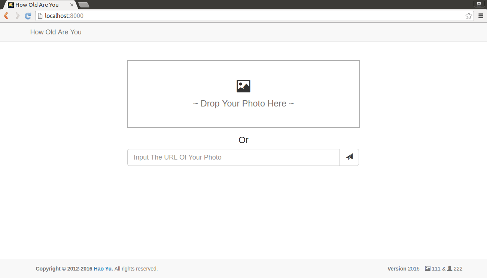

# How Old Are You

This project is a demo of the face.

Upload your photo, HowOldAreYou can search for the faces on the picture, estimate the sex, age, and smiling degree of each face.

If errors occurred in the result, you can correct them. Your correction will help us to improve the model.

The admin can train better models using the faces.

If you get any problem, do not hesitate to connect with [Hao Yu](http://haoyu.love).

## Contains

- A beautiful HTML5 website
- A beautiful HTML5 simple online management panel
- An easy-to-use face API
- An online model generator
- A benchmark generator
 
## Screenshots

## Deploy It

### package required:

This project requires OpenCV, Scikit-Learn, Scikit-Image and DLib.

Please see this blog: [Packages for Base Environment](http://haoyu.love/blog265.html).

#### How to deploy

This is a Django project.

Please see this document: [Deploying Django](https://docs.djangoproject.com/en/1.9/howto/deployment/)

## Train Initial Models

You should train some initial models after deploying HowOldAreYou.

## Use It

### Command

You can use the following commands with `python3 manage.py command [parameters]`

| Command | Note | Parameter |
| --- | --- | --- |
| howold_setup | Setup the HowOldAreYou website | None |
| howold_trainmodel | Train models | sex age smile |
| howold_refreshstd | Refresh files for benchmark | None |
